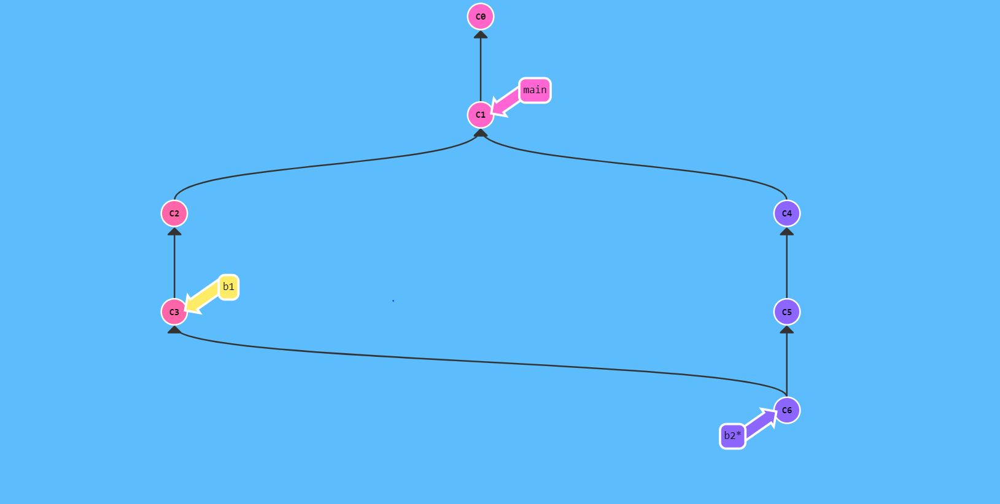
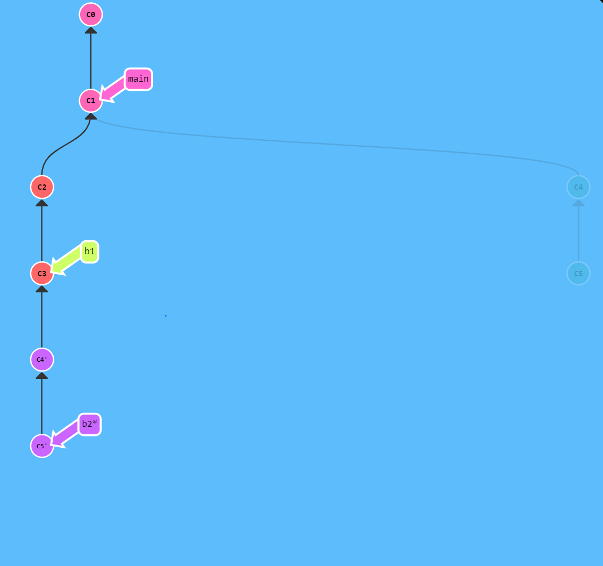
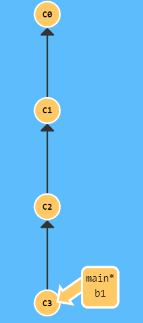
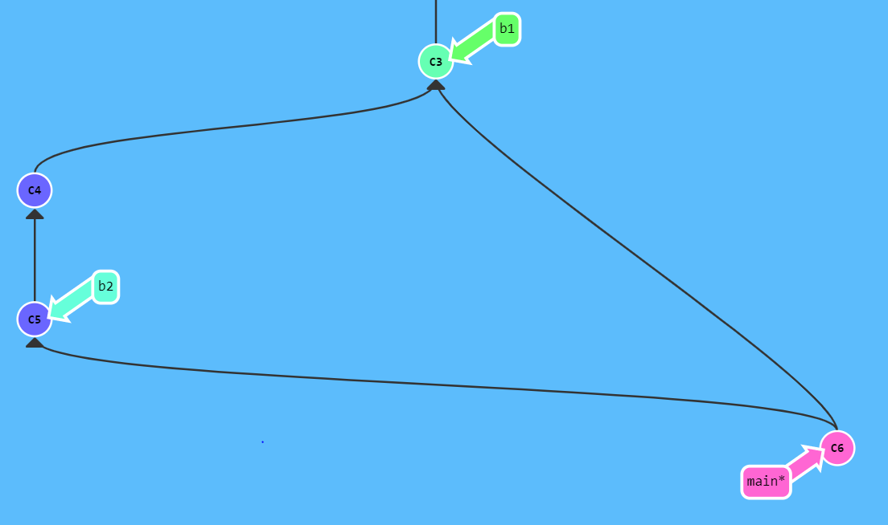

# Basic GIT

## Linking an exiting project to a Git remote

- `git remote add origin url_git_remote`

and check it's linked:

- `git remote -v`

## Git checkout branch from another branch

- `git checkout -b branch_name`

or

- `git switch -c branch_name`

## Git checkout branch from the certain commit of branch

- `git branch another_branch certain_commit_in_another_branch`

## Git add

- `git add file_name_has_changed`

or

- `git add .`

> Note: dot notation stands for all changed files.

## Git commit

- `git commit -m "messages here"`

options

- --amend: Edit code without creating a new commit and can change the message.
- --no-edit: Message editing isn't allowed.
- -a: like `git add file_name_has_changed`, e.g. `git commit -a -m "yolo"`

## Git push

- `git push -u origin branch_name`

> Note: -u stands for --set-upstream. It's used to link local and remote branch.

options

- -f: push force, it's usually used with `git commit --ament --no-edit`

## Git pull

- `git pull origin remote_branch_name`

options: By default is --merge

- --rebase: Merge commit from remote_branch_name, then add commit of current local_branch.

**_For instance:_**

- --merge: It will create commit c6 when perform merge b1 into b2.
  

- --rebase: It will NOT create commit when perform merge b1 into b2.
  

## Git merge with no fast forward

- `git merge branch_name --no-ff`

**_For instance_**

- Merge without no-fast-forward(default for `git merge`)

- Merge with no-fast-forward, it will preserve the commit and create a new commit.

## Git rebase

- `git rebase branch_name`

options

- --preserve-merges: It will preserve-merges, just like `--no-ff`, e.g. `git rebase b5 --preserve-merges`

## Git cherry-pick: get a certain commit from another branch

- `git cherry-pick certain-commit`
